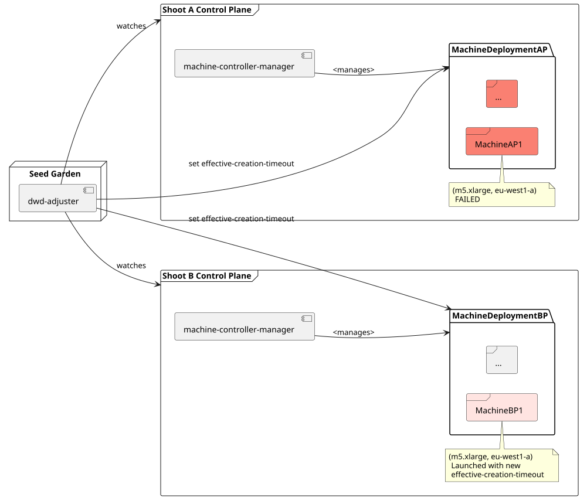
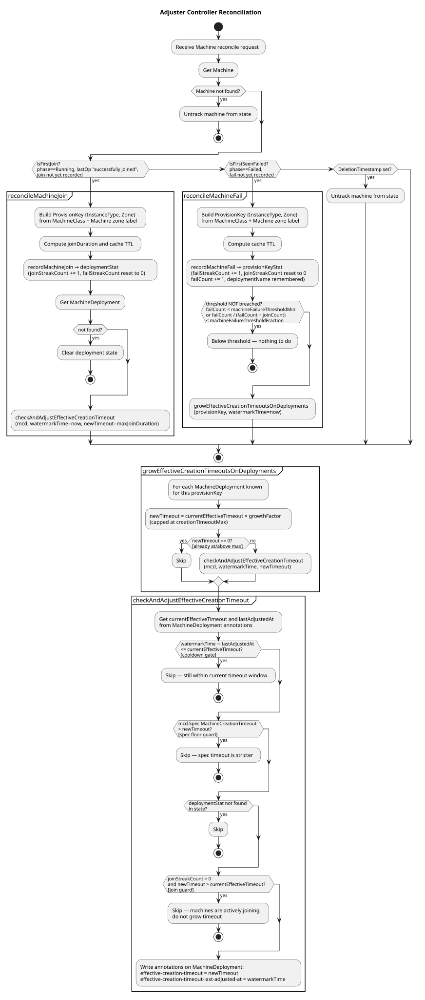

# Adjuster

## Overview

The current purpose of the Adjuster is to ensure that `machine-controller-manager` operator that is present across shoot
clusters is directed to allow sufficient time for [Machines](https://pkg.go.dev/github.com/gardener/machine-controller-manager@v0.62.1/pkg/apis/machine/v1alpha1#Machine) 
of a [MachineDeployment](https://pkg.go.dev/github.com/gardener/machine-controller-manager@v0.62.1/pkg/apis/machine/v1alpha1#MachineDeployment) to becoming `Running`
and join the shoot cluster.

Adjuster observes specific failures of
`machine-controller-manager` [Machine](https://pkg.go.dev/github.com/gardener/machine-controller-manager@v0.62.1/pkg/apis/machine/v1alpha1#Machine)
objects for every shoot cluster of the seed. If number of `Failed` Machines cross the `FailureThreshold` (configurable), then the
adjuster increases the [effective-creation-timeout](https://github.com/gardener/machine-controller-manager/issues/1098)
of the parent `MachineDeployment` for all machine deployments belonging to the same `instanceType` and `zone` 
(called `ProvisionKey`) across all shoots of the seed.

NOTE: The current implementation directly watches [Machine](https://pkg.go.dev/github.com/gardener/machine-controller-manager@v0.62.1/pkg/apis/machine/v1alpha1#Machine) of shoot clusters. In the future, this will be a falback and the adjuster will likely leverage Machine failure metrics produced by the MCM.

## Internals

## Config

Adjuster can be configured via command line arguments and an adjuster configuration. See [configure adjuster](../deployment/configure.md#adjuster).