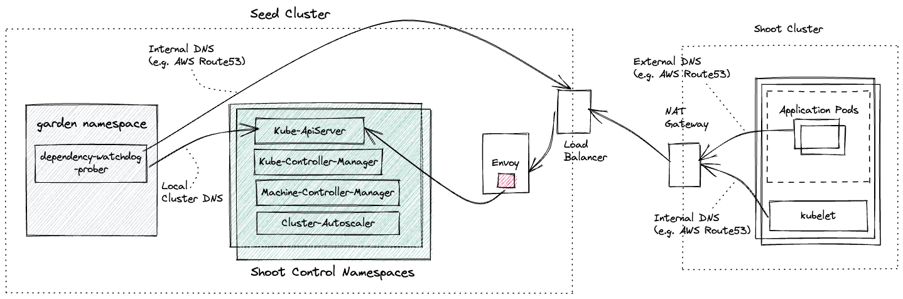

# Prober

Primary purpose of a prober is to detect if the Kube ApiServer is not reachable and then scale down dependent `Deployments` in order to prevent further downtime for the shoot cluster nodes. Dependent deployments can be configured via a prober configuration.

Prober periodically probes Kube ApiServer via two separate probes:
1.  Internal Probe: Local cluster DNS name which resolves to the ClusterIP of the Kube Apiserver
2.  External Probe: DNS name via which the kubelet running in each node in the data plane (a.k.a shoot in gardener terminology) communicates to the Kube Apiserver running in its control plane (a.k.a seed in gardener terminology)

If the internal probe fails then it skips the external probe as it indicates that the Kube ApiServer is down. In case the internal probe succeeds then it probes using the external probe. If the external probe fails consecutively for more than `failureThreshold` times then it assumes that the kubelet running in the nodes of the shoot cluster will be unable to renew their leases. This will have a cascading effect as Kube Controller Manager will transtion the status of the nodes to `Unknown`. This status change will be observed by the Machine Controller Manager which manages the lifecycle of the machines for the shoot cluster. After waiting rfor a configure period, Machine controller manager will trigger drain for these nodes and will subsequently stop these machines once new machines are launched.

To prevent downtime to consumer workloads that are running on the nodes of the shoot cluster in case the Kube Apiserver is not reachable prober will initiate a scale down of services which will react to the nodes not been able to renew their lease. In case of Gardener these comprise of Kube Controller Manager, Machine Controller Manager and Cluster Autoscaler. Consumers can configure the deployments that needs to be scaled down.

## Dependency Watchdog Prober in Gardener

Prober is a central component which is set up in the `garden` namespace in the seed cluster. If you are not familiar with what gardener components like seed, shoot then please see the [appendix](#appendix) for links.

## Appendix

* [Gardener](https://github.com/gardener/gardener/blob/master/docs)
* [Reverse Cluster VPN](https://github.com/gardener/gardener/blob/master/docs/proposals/14-reversed-cluster-vpn.md)