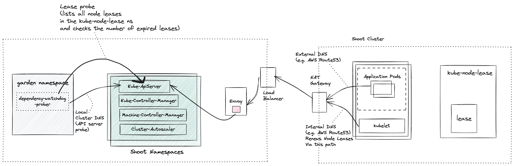

# Prober

## Overview

Prober starts asynchronous and periodic probes for every shoot cluster. The first probe is the api-server probe which checks the reachability of the API Server from the control plane. The second probe is the lease probe which is done after the api server probe is successful and checks if the number of expired node leases is below a certain threshold. 
If the lease probe fails, it will scale down the dependent kubernetes resources. Once the connectivity to `kube-apiserver` is reestablished and the number of expired node leases are within the accepted threshold, the prober will then proactively scale up the dependent kubernetes resources it had scaled down earlier. The failure threshold fraction for lease probe
and dependent kubernetes resources are defined in [configuration](/example/04-dwd-prober-configmap.yaml) that is passed to the prober.

### Origin

In a shoot cluster (a.k.a data plane) each node runs a kubelet which periodically renewes its lease. Leases serve as heartbeats informing Kube Controller Manager that the node is alive. The connectivity between the kubelet and the Kube ApiServer can break for different reasons and not recover in time. 

As an example, consider a large shoot cluster with several hundred nodes. There is an issue with a NAT gateway on the shoot cluster which prevents the Kubelet from any node in the shoot cluster to reach its control plane Kube ApiServer. As a consequence, Kube Controller Manager transitioned the nodes of this shoot cluster to `Unknown` state. 

[Machine Controller Manager](https://github.com/gardener/machine-controller-manager) which also runs in the shoot control plane reacts to any changes to the Node status and then takes action to recover backing VMs/machine(s). It waits for a grace period and then it will begin to replace the unhealthy machine(s) with new ones.

This replacement of healthy machines due to a broken connectivity between the worker nodes and the control plane Kube ApiServer results in undesired downtimes for customer workloads that were running on these otherwise healthy nodes. It is therefore required that there be an actor which detects the connectivity loss between the the kubelet and shoot cluster's Kube ApiServer and proactively scales down components in the shoot control namespace which could exacerbate the availability of nodes in the shoot cluster.

## Dependency Watchdog Prober in Gardener

Prober is a central component which is deployed in the `garden` namespace in the seed cluster. Control plane components for a shoot are deployed in a dedicated shoot namespace for the shoot within the seed cluster. 



> NOTE: If you are not familiar with what gardener components like seed, shoot then please see the [appendix](#appendix) for links.

Prober periodically probes Kube ApiServer via two separate probes:
1.  API Server Probe: Local cluster DNS name which resolves to the ClusterIP of the Kube Apiserver
2.  Lease Probe: Checks for number of expired leases to be within the specified threshold. The threshold defines the limit after which DWD can say that the kubelets are not able to reach the API server.

## Behind the scene

For all active shoot clusters (which have not been hibernated or deleted or moved to another seed via control-plane-migration), prober will schedule a probe to run periodically. During each run of a probe it will do the following:
1. Checks if the Kube ApiServer is reachable via local cluster DNS. This should always succeed and will fail only when the Kube ApiServer has gone down. If the Kube ApiServer is down then there can be no further damage to the existing shoot cluster (barring new requests to the Kube Api Server).
2. Only if the probe is able to reach the Kube ApiServer via local cluster DNS, will it attempt to check the number of expired node leases in the shoot. The node lease renewal is done by the Kubelet, and so we can say that the lease probe is checking if the kubelet is able to reach the API server. If the number of expired node leases reaches 
 the threshold, then the probe fails.
3. If and when a lease probe fails, then it will initiate a scale-down operation for dependent resources as defined in the prober configuration.
4. In subsequent runs it will keep performing the lease probe. If it is successful, then it will start the scale-up operation for dependent resources as defined in the configuration.

### Prober lifecycle

A reconciler is registered to listen to all events for [Cluster](https://github.com/gardener/gardener/blob/master/docs/api-reference/extensions.md#extensions.gardener.cloud/v1alpha1.Cluster) resource.

When a `Reconciler` receives a request for a `Cluster` change, it will query the extension kube-api server to get the `Cluster` resource. 

In the following cases it will either remove an existing probe for this cluster or skip creating a new probe:
1. Cluster is marked for deletion.
2. Hibernation has been enabled for the cluster.
3. There is an ongoing seed migration for this cluster.
4. If a new cluster is created with no workers.
5. If an update is made to the cluster by removing all workers (in other words making it worker-less).

If none of the above conditions are true and there is no existing probe for this cluster then a new probe will be created, registered and started.

### Probe failure identification

DWD probe can either be a success or it could return an error. If the API server probe fails, the lease probe is not done and the probes will be retried. If the error is a `TooManyRequests` error due to requests to the Kube-API-Server being throttled,
then the probes are retried after a backOff of `backOffDurationForThrottledRequests`. 

If the lease probe fails, then the error could be due to failure in listing the leases. In this case, no scaling operations are performed. If the error in listing the leases is a `TooManyRequests` error due to requests to the Kube-API-Server being throttled,
then the probes are retried after a backOff of `backOffDurationForThrottledRequests`.

If there is no error in listing the leases, then the Lease probe fails if the number of expired leases reaches the threshold fraction specified in the [configuration](/example/04-dwd-prober-configmap.yaml). 
A lease is considered expired in the following scenario:-
```
	time.Now() >= lease.Spec.RenewTime + (p.config.KCMNodeMonitorGraceDuration.Duration * expiryBufferFraction)
```
Here, `lease.Spec.RenewTime` is the time when current holder of a lease has last updated the lease. `config` is the probe config generated from the [configuration](/example/04-dwd-prober-configmap.yaml) and
`KCMNodeMonitorGraceDuration` is amount of time which KCM allows a running Node to be unresponsive before marking it unhealthy (See [ref](https://kubernetes.io/docs/reference/command-line-tools-reference/kube-controller-manager/#:~:text=Amount%20of%20time%20which%20we%20allow%20running%20Node%20to%20be%20unresponsive%20before%20marking%20it%20unhealthy.%20Must%20be%20N%20times%20more%20than%20kubelet%27s%20nodeStatusUpdateFrequency%2C%20where%20N%20means%20number%20of%20retries%20allowed%20for%20kubelet%20to%20post%20node%20status.))
. `expiryBufferFraction` is a hard coded value of `0.75`. Using this fraction allows the prober to intervene before KCM marks a node as unknown, but at the same time allowing kubelet sufficient retries to renew the node lease (Kubelet renews the lease every `10s` See [ref](https://kubernetes.io/docs/reference/config-api/kubelet-config.v1beta1/#:~:text=The%20lease%20is%20currently%20renewed%20every%2010s%2C%20per%20KEP%2D0009.)).

## Appendix

* [Gardener](https://github.com/gardener/gardener/blob/master/docs)
* [Reverse Cluster VPN](https://github.com/gardener/gardener/blob/master/docs/proposals/14-reversed-cluster-vpn.md)