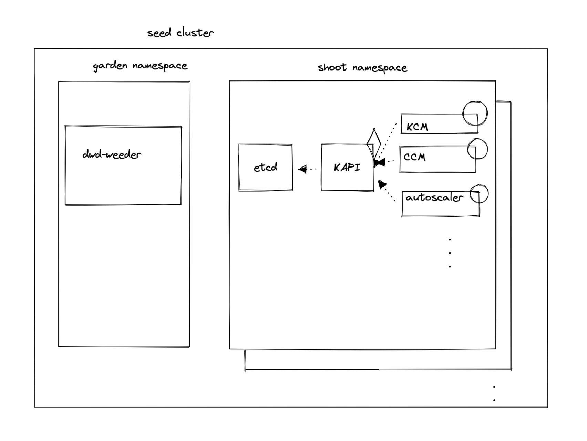

# Weeder

## Overview

Weeder is a loop which watches a k8s service for any downtime, and after the recovery of the service from the downtime, it restarts any Crashlooping pods which depends on that service.
This is helpful because kubernetes pod restarts a container with an exponential backoff when the pod is in `CrashLoopBackOff` state. This backoff could become quite large if the service stays down for long. Presence of weeder would not let that happen as it'll restart the pod.

## Prerequisites

Before we understand how Weeder works, we need to be familiar with kubernetes [services & endpoints](https://kubernetes.io/docs/concepts/services-networking/service/).

> NOTE: Services can be defined without selectors in which case endpoints objects are not created. The given documentation is explained with assumption that services with label selectors are used so using them interchangably. Though they are supported because Weeder doesn't take the service resource into account, its only concerned with endpoints resource. So in the config file for weeder, only endpoints name should be specified.

## Config

Weeder can be configured via command line arguments and a weeder configuration. See [configure weeder](../deployment/configure.md#weeder).

## Internals

Weeder keeps a watch on the events for the specified endpoints in the config. For every endpoints a list of `podSelectors` can be specified. It cretes a weeder object per endpoints resource when it receives a satisfactory `Create` or `Update` event. Then for every podSelector it creates a goroutine. This goroutine keeps a watch on the pods with labels as per the podSelector and kills any pod which turn into `CrashLoopBackOff`. Goroutine live for 5minutes by default. This time is configurable using the `watchDuration` in the config.

Lets consider the diagram below

The diagram depicts the two (service,dependent-pods) relations specified in the config file specified in the [config-file-for-weeder](#config) section. Lets consider the (etcd,KAPI) relation for now. 

**Note**: Time here is just for showing the series of events

* `t=0` -> both etcd pods go down (assuming 2)
* `t=10` -> KAPI starts CrashLooping
* `t=100` -> both etcd pods recover together
* `t=101` -> Weeder sees `Update` event for `etcd-main-client` endpoints resource
* `t=102` -> go routine created to keep watch on KAPI pods
* `t=103` -> KAPI pod deleted
* `t=104` -> new KAPI pod created by replica-set controller in KCM

## Points to Note

* Weeder only respond on `Update` events where a `notReady` endpoints resource turn to `Ready`. Thats why there was no weeder action at time `t=10` in the example above.
  * `notReady` -> no backing pod is Ready
  * `Ready`    -> atleast one backing pod is Ready
* Weeder doesn't respond on `Delete` events

